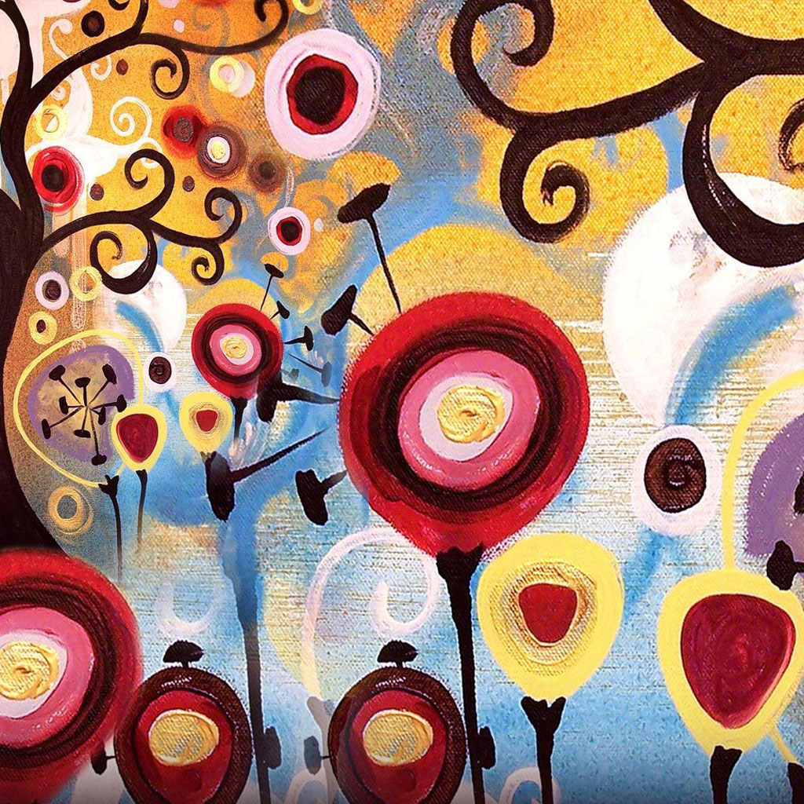
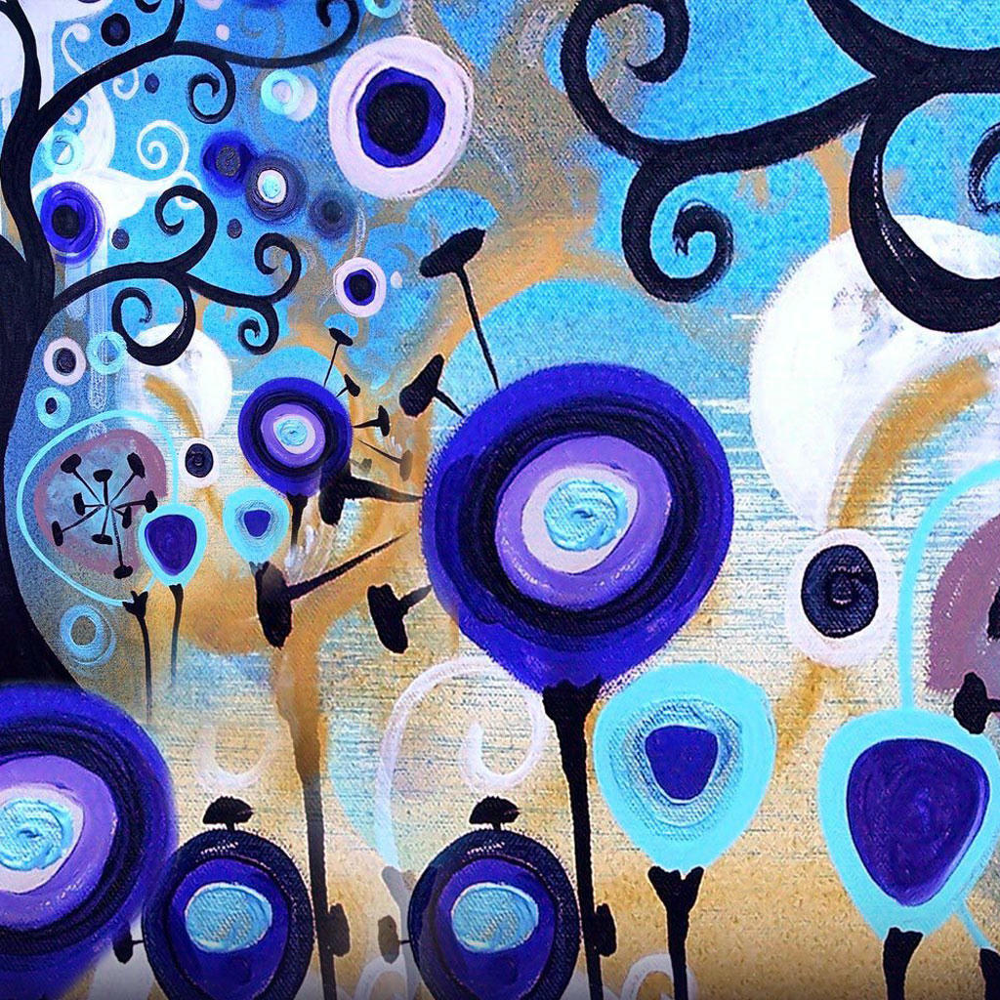

# Image Python interop

This demo transfers an `image::RgbImage` to Python and a `torch.Tensor` back to Rust through DLPack.

## Usage

```shell
uv run --reinstall-package dlpark-image-python smoke.py
```

| Input RGB Image     | Output BGR Image |
| ------------------- | ---------------- |
|  |   |
